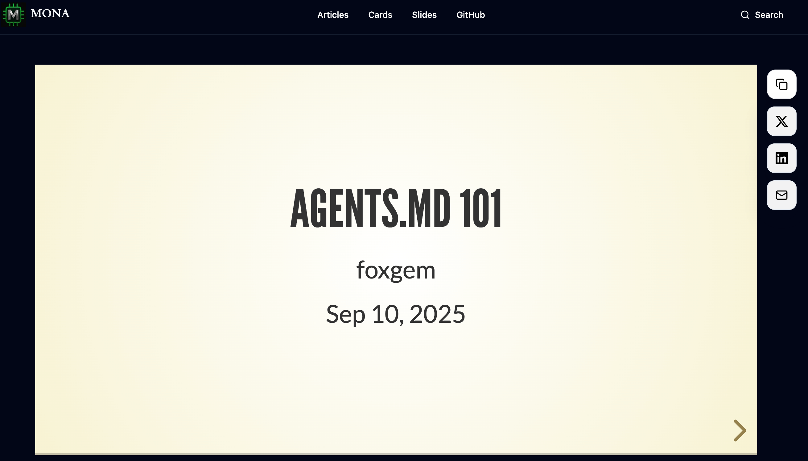

【注：冯宇提供第一版，胡键在此基础上补充整个过程的前因后果且重新梳理文字和格式。】

## Claude Code 的第一版实现

[我们的英文技术站点 Mona](https://www.mymona.xyz/) 实现了 Slides 功能，采用的技术方案是使用 [Reveal.js](https://revealjs.com/) 来渲染 Markdown 文本。其效果如下图:

- 最新幻灯片


- 单个幻灯片



它的实现并不复杂，按照 Astro 的套路来就行了：

1. 新建一个内容类型。
1. 新建对应的 Astro 页面。
1. 集成 Reveal.js。

Slides 中自然少不了图片，而 Reveal.js 本身是客户端渲染，如果只是简单地像对待一般 Astro 工程中的 blog 那样直接在 content 目录下放图片，然后在 Markdown 中引用图片路径，则 Reveal.js 渲染时会报图片无法显示。因为对于这个新的内容类型，Astro 并不会像对待其缺省支持的 blog 那样，自动处理 Markdown 中的图片路径。

解决其实也很简单，当时在用的 Claude Code 也随即给出快糙猛的方案：在构建时将图片复制到 `public/` 目录下，然后替换 Markdown 中的图片路径。它甚至还优雅地写了一个 Vite 插件来实现这个功能。

这个方案的好处在于：

1. slides 作者可以无需关心图片路径问题。
1. 图片和 Markdown 可以放在一起，方便管理。

就这样第一个版本上线了，虽然不完美，但是可以用够了。

## 尝鲜 Codex CLI，让它来优化

作为有一定技术品味的团队，我们当然不会止于一时的权宜之策。

由于 Astro 本身就有成熟的图片优化处理（ cache busting 、转换 webp 等），并在 blog 中得到了很好的应用，我们当然希望 Slides 中的图片也能享受到 Astro 的图片优化方案。使得 Slides 中的图片也能享受到 Astro 的图片优化方案，即：更加的 Astro Native！

### 必要的知识背景

先说一下 Blog 中图片处理的过程，比如下面 Markdown 中引用的图片：

```md

```

在 Astro 构建过程中，会将图片优化成类似于 `/_astro/imgs/example.abc123.webp` 这样的路径，直接使用原有的路径显然就无法正常显示图片了。

这个问题在 Astro 自己渲染 Markdown 为 HTML 是不会遇到的，因为 Astro render markdown 的过程中会自动进行图片路径的替换。但是在使用 Reveal.js 渲染的时候，由于无法使用 Astro 内置的 Render API 处理，自然就有问题。

### 使用 Codex CLI 分析问题

恰好其时 Codex CLI 有了新发布且新版口碑不错，而 Claude Code 又有降智和限制国内开发者使用的风波，所以我决定尝试一下 Codex CLI，看看它能否帮我分析并解决这个问题。

之前我们已经小范围尝试过 Codex CLI，我认为它在社区广受好评的原因是它生成的代码质量确实不错，幻觉较少，因为我发现它在思考的过程中会主动搜索相关资料，甚至直接去源码仓库寻找要调用的类库的源码，比如我发现它会主动读取 `node_modules/` 目录下的包目录中的 `*.d.ts` 文件，以及相关的源码文件，来理解某个类库的用法，这点非常棒。这个行为是我在其他 AI 工具中鲜有见到的，它会让结果更准确。如果在提示词中明确指示它必须这么做，那么它更会遵循这个要求，其他的 AI 往往并不会这么做，导致幻觉率比较高，生成的代码几乎没法用。

所以我在提示词中要求它主动从源码和互联网中寻找解决方案，让方案更有可信度，大致的提示词如下:

```txt
... (省略大段描述代码现状的内容，以及遇到的问题) ...

你需要仔细理解我的问题，并详细分析可能解决方案。包括但不限于以下手段:

- 源码级别分析，找到 Astro 的源码，看看它怎么处理这种图片的？是否有暴露获取图片真实路径的方法或接口
- 查询官方文档，是否有蛛丝马迹？
- 直接互联网搜索，看看别人是否遇到过这个问题，是否已经解决？
```

于是 Codex 真的进行了大量的搜索，并返回了以下结果 (节选):

#### 核心结论

- `slide.body` 在 `src/pages/slides/[...slug].astro` 中被当作纯字符串塞进 `SlideViewer`，而这个 React 组件带有 `client:only="react"`，意味着 Markdown 永远只在浏览器里解析，Astro/Vite 无法介入去解析 ``、也无法替换资源路径，导致相对路径仍指向 `./imgs/_`。(来源网站)
- 目前的 `slideImagesPlugin` 只是把图片额外复制到 `public/slides/**/imgs` 以维持旧路径，但绕过了 Astro 的图片优化与缓存；这就是“临时方案不够优雅”的根源（`config/vite-plugin-slide-images.ts:1`）。
- 博客页在 `src/pages/blogs/[...slug].astro:27` 里调用了 `const { Content } = await render(post);`，也就是利用 Astro 的编译链获取 `<Content />`，因此 Markdown 内的图片会被编译期改写成 `/_astro/_.png` 并交给图片服务托管。(来源网站)

#### 并给出了 3 种解决方案 (节选)

- 方案 A（保持 Astro 处理链）：切换到 `import.meta.glob` 以 `eager: true` 方式载入 slide Markdown，拿到 MarkdownInstance，直接调用 `compiledContent()` 得到 Astro 已经处理好的 HTML（包含正确的 `/_astro/…` 路径），再把 HTML 拆成 Reveal 所需的 `<section>` 或在 React 里用 dangerouslySetInnerHTML 渲染。优点是完全复用 Astro 的优化与域名白名单；缺点是需要在服务器侧追加一次 HTML→Section 的切分逻辑。
- 方案 B（生成图片映射清单）：利用 `import.meta.glob('/src/content/slides/*_/imgs/_', { import: 'default', query: '?url', eager: true })` 在构建期生成 “原始相对路径 → 产物 URL” 的映射；在把 Markdown 传给 SlideViewer 前，用正则或 remark 插件把 `./imgs/foo.png` 替换成映射后的 `/_astro/...`。这样 Reveal 仍吃 Markdown，但路径已经安全。复杂度相对低，且尊重 Astro 对资源的指纹化处理。
- 方案 C（真正定制 markdown pipeline）：在 Astro markdown.remarkPlugins 中注入自定义 remark plugin，遇到 image 节点时调用 Vite 的 `this.load({ id, query: '?url' })` 或 `new URL(relativePath, import.meta.url).href` 获取最终 URL 并替换。这是最贴近 Astro 原生做法，但实现量最大，且要注意在 SSR 环境中处理异步。

分析还是非常准确的，确实也指出了之前“不够优雅”的解决方法。但是我不会照单全收，作为 AI 的使用者，必须要有自己的判断力，不能完全依赖 AI 的分析与结论。

### 我的思考与实践

其实这三种方案我都不太满意。因为我想要一个“简单”的解决方案，这三种方案不是太重就是偏离了原本的需求，感觉都难以落地。

于是我在评估这三种方案之后，又提出我的方案，就是是否能改用 Astro 组件代替 React 组件（SlideViewer），这样应该可以调用 Astro 内部的处理管线。跟 Codex 讨论后，觉得这个方案不可行，这个迁移会特别复杂，而且不能完全解决我们的问题。

于是我决定自己先向前走一步，看看能否找到更好的解决方案。在日志中加入一些打印语句后，我发现 Astro 会将解析过的 content 内容封装在 `getEntry()` 方法中返回的对象里，而这个对象会包含一些元数据和 `rendered` 对象，其中，里面的元数据中包含了 markdown 中引用的图片地址。类似于这样:

```js
{
  headings: [
    ...
  ],
  localImagePaths: [ './imgs/agents-md-ecosystem.png' ],
  remoteImagePaths: [],
  frontmatter: {
    ...
  },
  imagePaths: [ './imgs/agents-md-ecosystem.png' ]
}
```

我将打印出来的结果交给 Codex 进一步分析，看看能否从这里做文章，这次 Codex 给出了新的方案，并且我觉得非常可行:

... (前后几个我觉得不太合适的方案省略) ...

#### 方案二：在服务器端先把 Markdown 里的相对路径替换成哈希 URL

在这个方案中，Codex 认为可以利用 Vite 的 `eager` import 功能，将所有的图片路径提前导入，获取所有本地图片的编译后路径，然后将 Markdown 中的相对路径替换成哈希 URL，这样图片就可以正常加载了。

这样处理后的 Markdown 在客户端解析时就会使用 `/_astro/…` 资源了。

这个方案明显就靠谱了非常多，在尝试之后，发现确实可行。再经过几轮提示词的调整，让 Codex 生成了可以直接获取经过 Astro 优化过的图片路径的代码，可以完美的将 Markdown 中的图片路径替换为经过 Astro 优化后的 webp 图片地址，而其他保持不变。

这次终于比较完美的解决了问题，大约一共花费了 2 小时左右的时间。Codex 的联网搜索功能真的太棒了，节省了大量自己研究的实现，防止踩坑，及时拉回正规上。

## 总结

回顾整个过程，虽然 Codex 本身功能出众，但是若非作为操控者的人在一旁指导，恐怕也难以得到一个让人满意的结果，很可能不是过于简单就是过于复杂，而非现在这种“刚刚好”的结果。
